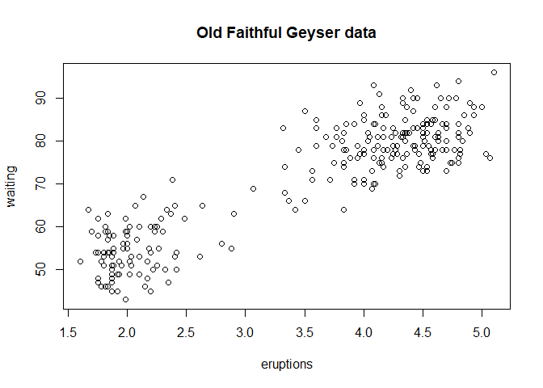

# Week 1 

##

## Graphics Devices

Two ways to create a plot:  

1. Call a plotting function, and the plot appears on the screen  
   - Annotate the plot if necessary  
2. For sending a plot to a file device (plot will not actually appear on screen):  
   A. Explicitly launch graphics device  
   B. Call a plotting function to make a plot (copy paste from script)  
   C. Annotate if necessary  
   D. **Important!** Explicitly *close* graphics device with `dev.off()`  


```r
library(datasets)
with(faithful, plot(eruptions, waiting)) ## make plot appear on the screen
title(main = "Old Faithful Geyser data")  ## Annotate with a title
```

<!-- -->


Two basic types of file  

* Vector  
   - pdf  
   - svg  
   - win.meta  
* Bitmap  
   - png  
   - jpeg  
   - tiff  
   - bmp  


# Week 2

## Lattice Plotting System

Useful for plotting high dimensional data and for making many plots at once.

* have to create entire plot at once (cannot annotate later)  
* uses *formula* notation eg. `xyplot(y ~ x | f * g, data)`  
  - "~" means y as a function of x  
  - f and g are *conditioning variables* (optional)  
    - "*" indicates an interaction between two variables  
* the second argument is the data frame or list where the variables are found  
  - if missing it will look in your workspace for the variables    

The Lattice plotting system is implemented using the following packages:

* *lattice* - contains code for producing Trellis graphics (independent of "base" graphics) and contains functions like: 
   - `xyplot` scatterplots  
   - `bwplot` box-and-whiskers plots ("boxplots")  
   - `histogram`  
   - `stripplot` like a boxplot but with actual points  
   - `dotplot` plot dots on "violin strings"  
   - `splom` scatterplot matrix (like `pairs` in base plotting system)  
   - `levelplot`. `contourplot` for plotting "image" data 
* *grid* - the *lattice* package builds ontop of *grid* (implements a different graphing system independent of "base" system)  


```r
library(lattice)
```

```
## Warning: package 'lattice' was built under R version 3.6.3
```

```r
library(datasets)
## simple scatterplot
xyplot(Ozone ~ Wind, data = airquality)
```

<!-- -->

END
