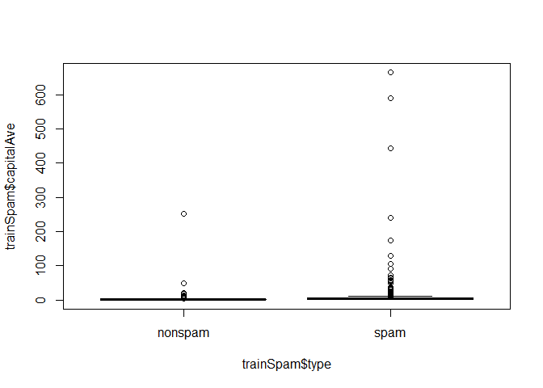
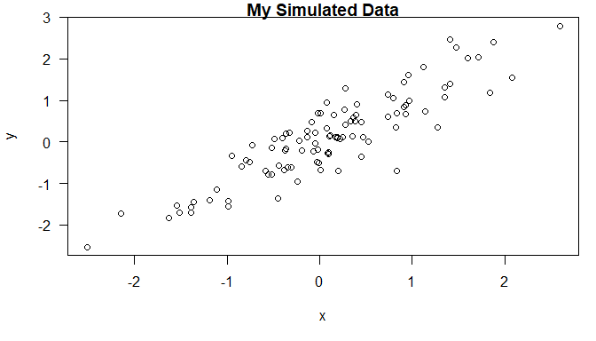

# Week 1  

## Concepts and Ideas  
A problem in data anlysis - don't have universal notation system for communicating  your data analysis.  

### *Replication*  

* Replication of findings is the ultimate standard for strengthening scientific evidence (ie. independent verification)
  - important if study can impact policy or regulatory decisions
  - some studies cannot be replicated (time, money, unique oppertunity)
  - If can't replicate a study, is the alternative just to do nothing?
* Reproducibility bridges this gap (middle ground/minimum standard).
  - make analytic data and code available so others may reproduce findings
  - validation of data analysis
    + complex statistical methods subjected to intense scrutiny

### *Research Pipeline*

* Measured Data
  - Processing code
* Analytic Data
  - Analytic code
* Computational Results
  - presentation code
    + Figures
    + Tables
    + Numerical summaries
* Article
  - Text
  
As a reader we go backwards through the pipeline.  

After a scandal at Duke U where many results were found not to be reproducible the Institute of Medicine (IOM) issued these *best practices* to encourage reproducibility.

* Data and Metadata used to develop tests should be made pubically available
* Computer code and fully specified computational procedures
  - Ideally should encompass all steps of computational analysis
  - All aspects of analysis should be transparently reported

What do we need for Reproducible research?

* Analytic data are available (raw data may be impractical)
* Analytic code are available
* Documentation of code and data
* Standard means of distribution (easily accessable)

### *Literate (Statistical) Programming*  

Think of an article as a stream of **text** and **code**

* divided into text and code "chunks"
  - text requires a documentation language (human readable)
  - code chunks requires a programming language (machine readable)
* `knitr` is a package that accomplishes this
  - R is the programming language (though others allowed)
  - Variety of documentation languages (LaTeX, Markdown, HTML)
  - Developed by Yihui Xie ('E-hu-way Si-a')

## Scripting your Analysis

*Script Everything* -- Golden Rule of Reproducibility


## Structure of a Data Analysis

### *Steps in a data analysis*

1. Define the question
   - This is the most powerful dimension reduction tool you can employ!
   - not every data analysis starts with a specific, coherent question, but the
    more effort you put into comming up with a reasonable question, the less
    effort you'll have to spend filtering through a lot of "stuff" later
2. Define the ideal data set
   - Depends on your goal 
     + descriptive -- need a whole population
     + exploratory -- a random sample with many variables
     + inferential -- the right population, randomly sampled
     + predictive -- a training and test data set from same population
     + causal -- data from randomized study
     + mechanistic -- data about all components of the system
3. Determine what data you can access
    - free data on the web
    - buy data
    - data don't exist -- generate yourself
4. Obtain the data
   - try to obtain the raw data
   - Be sure to reference the source
   - polite emails go a long way
   - if loading data from an internet source, record the url and time accessed
5. Clean the data (*document everything you do!*)
   - raw data often needs to to be processed
   - pre-processed -- make sure you understand how it was done
   - understand the source of the data (census, convenience sample, observational
     study, experiment, etc.)
   - reformat data to make work for specific anlaysis
   - large data set may need to subsample to make more managable
   - **Determine if data are good enough** -- if not, quit or change data
     + enough data?
     + enough variables of characteristics?
     + Is the sampling of data appropiate for your question?
     + Don't just push on with the data that you have -- can lead to
       *inappropriate inferences or conclusions*.
6. Exploratory data analysis
   - look at summaries of the data
   - check for missing data
   - create exploratory plots
   - perform exploratory analyses (e.g. clustering)
7. Statistical prediction/modeling
   - Should be informed by the results of your exploratory analysis
   - Exact methods depend on the question of interest
   - Transformations/processing should be accounted for when necessary
   - Measures and sources of uncertainty should be reported
8. Interpret results
   - Use the appropriate language
     + "describes"
     + "correlates with" or "associated with"
     + "leads to" or "causes"
     + "predicts"
   - Give an explanation
   - Interpret coefficients
   - Interpret measures of uncertainty
9. Challenge results
   - All steps (Question, Data source, Processing, Analysis, Conclusions)
   - Measures of uncertainty -- _appropiate?_
   - Choices of terms to include in models -- _appropaite model? how did you  chose things to include?_
   - Think of potential alternative analyses
   - *Ask yourself and have a reasonable answer to theses questions!*
10. Synthesize/write up results
    - Lead with the question
    - Summarize the analyses into the story
    - Don't include every analysis, include it only if:
      + it is needed for the story
      + it is needed to address a challenge
    - Order analyses according to the story, rather than chronologically
    - Include well designed figures that contribute to the story
11. Create reproducible code

#### Example

1. Can I use quantitative characteristics of emails to classify them as spam?
2. Ideal: all of emails in Gmail system in Google's data centers
3. UCI machine learning repository -- "Spambase Data Set"
   * available in Kernlab package's "spam" data set (already "cleaned up")
4. Obtain data from `kernlab` package


```r
#install.packages("kernlab")
library(kernlab)
data("spam")
str(spam[,1:5])
```

```
## 'data.frame':	4601 obs. of  5 variables:
##  $ make   : num  0 0.21 0.06 0 0 0 0 0 0.15 0.06 ...
##  $ address: num  0.64 0.28 0 0 0 0 0 0 0 0.12 ...
##  $ all    : num  0.64 0.5 0.71 0 0 0 0 0 0.46 0.77 ...
##  $ num3d  : num  0 0 0 0 0 0 0 0 0 0 ...
##  $ our    : num  0.32 0.14 1.23 0.63 0.63 1.85 1.92 1.88 0.61 0.19 ...
```

5. Already clean but need to subsample for training model


```r
# Perform the subsampling
set.seed(3435)
trainIndicator <- rbinom(4601, size = 1, prob = 0.5)
table(trainIndicator)
```

```
## trainIndicator
##    0    1 
## 2314 2287
```

```r
trainSpam <- spam[trainIndicator == 1, ]
testSpam <- spam[trainIndicator == 0, ]
```

6. Exploratory data analysis


```r
names(trainSpam)  # common words in emails
```

```
##  [1] "make"              "address"           "all"              
##  [4] "num3d"             "our"               "over"             
##  [7] "remove"            "internet"          "order"            
## [10] "mail"              "receive"           "will"             
## [13] "people"            "report"            "addresses"        
## [16] "free"              "business"          "email"            
## [19] "you"               "credit"            "your"             
## [22] "font"              "num000"            "money"            
## [25] "hp"                "hpl"               "george"           
## [28] "num650"            "lab"               "labs"             
## [31] "telnet"            "num857"            "data"             
## [34] "num415"            "num85"             "technology"       
## [37] "num1999"           "parts"             "pm"               
## [40] "direct"            "cs"                "meeting"          
## [43] "original"          "project"           "re"               
## [46] "edu"               "table"             "conference"       
## [49] "charSemicolon"     "charRoundbracket"  "charSquarebracket"
## [52] "charExclamation"   "charDollar"        "charHash"         
## [55] "capitalAve"        "capitalLong"       "capitalTotal"     
## [58] "type"
```

```r
head(trainSpam)   # frequencies in which words occur in a given email
```

```
##    make address  all num3d  our over remove internet order mail receive will
## 1  0.00    0.64 0.64     0 0.32 0.00   0.00        0  0.00 0.00    0.00 0.64
## 7  0.00    0.00 0.00     0 1.92 0.00   0.00        0  0.00 0.64    0.96 1.28
## 9  0.15    0.00 0.46     0 0.61 0.00   0.30        0  0.92 0.76    0.76 0.92
## 12 0.00    0.00 0.25     0 0.38 0.25   0.25        0  0.00 0.00    0.12 0.12
## 14 0.00    0.00 0.00     0 0.90 0.00   0.90        0  0.00 0.90    0.90 0.00
## 16 0.00    0.42 0.42     0 1.27 0.00   0.42        0  0.00 1.27    0.00 0.00
##    people report addresses free business email  you credit your font num000
## 1    0.00      0         0 0.32        0  1.29 1.93   0.00 0.96    0      0
## 7    0.00      0         0 0.96        0  0.32 3.85   0.00 0.64    0      0
## 9    0.00      0         0 0.00        0  0.15 1.23   3.53 2.00    0      0
## 12   0.12      0         0 0.00        0  0.00 1.16   0.00 0.77    0      0
## 14   0.90      0         0 0.00        0  0.00 2.72   0.00 0.90    0      0
## 16   0.00      0         0 1.27        0  0.00 1.70   0.42 1.27    0      0
##    money hp hpl george num650 lab labs telnet num857 data num415 num85
## 1   0.00  0   0      0      0   0    0      0      0 0.00      0     0
## 7   0.00  0   0      0      0   0    0      0      0 0.00      0     0
## 9   0.15  0   0      0      0   0    0      0      0 0.15      0     0
## 12  0.00  0   0      0      0   0    0      0      0 0.00      0     0
## 14  0.00  0   0      0      0   0    0      0      0 0.00      0     0
## 16  0.42  0   0      0      0   0    0      0      0 0.00      0     0
##    technology num1999 parts pm direct cs meeting original project re edu table
## 1           0    0.00     0  0   0.00  0       0      0.0       0  0   0     0
## 7           0    0.00     0  0   0.00  0       0      0.0       0  0   0     0
## 9           0    0.00     0  0   0.00  0       0      0.3       0  0   0     0
## 12          0    0.00     0  0   0.00  0       0      0.0       0  0   0     0
## 14          0    0.00     0  0   0.00  0       0      0.0       0  0   0     0
## 16          0    1.27     0  0   0.42  0       0      0.0       0  0   0     0
##    conference charSemicolon charRoundbracket charSquarebracket charExclamation
## 1           0         0.000            0.000                 0           0.778
## 7           0         0.000            0.054                 0           0.164
## 9           0         0.000            0.271                 0           0.181
## 12          0         0.022            0.044                 0           0.663
## 14          0         0.000            0.000                 0           0.000
## 16          0         0.000            0.063                 0           0.572
##    charDollar charHash capitalAve capitalLong capitalTotal type
## 1       0.000    0.000      3.756          61          278 spam
## 7       0.054    0.000      1.671           4          112 spam
## 9       0.203    0.022      9.744         445         1257 spam
## 12      0.000    0.000      1.243          11          184 spam
## 14      0.000    0.000      2.083           7           25 spam
## 16      0.063    0.000      5.659          55          249 spam
```

```r
table(trainSpam$type)
```

```
## 
## nonspam    spam 
##    1381     906
```

```r
plot(trainSpam$capitalAve ~ trainSpam$type)
```

<!-- -->

The data are highly skewed so we will look at the log transformation. There are many zeros in this variable, and taking the log of 0 doesn't make sense, so we will just add 1 to that variable to get a sense of what the data look like (typically we wouldn't want to just add 1 to a variable without a solid reason, but since we are just exploring the data it is acceptable in this case).


```r
plot(log10(trainSpam$capitalAve + 1) ~ trainSpam$type)
```

<!-- -->

Above, we can see that spam emails have a higher rate of capital letters than non-spam emails.  

We can also look at pairwise relationships between variables (below).


```r
plot(log10(trainSpam[, 1:4] + 1))
```

<!-- -->

Now, we will explore the predictor space with a hierarchical cluster analysis.

```r
hCluster <- hclust(dist(t(trainSpam[, 1:57])))
plot(hCluster)
```

<!-- -->

Not particularly helpful (though does separate out capital total variable). Recall, however, that clustering algorthims can be sensitive to any skewness in the distribution of individual variables. Therefore, it may be useful to redo the clustering analysis after a transformation of the predictor space.1


```r
hClusterUpdated <- hclust(dist(t(log10(trainSpam[, 1:55] + 1))))
plot(hClusterUpdated)
```

<!-- -->

7. Basic statistical model
   - go through each variable in data set and try to fit a generalized linear model (logistic regression) to see if can predict Spam email by just a single variable


```r
trainSpam$numType <- as.numeric(trainSpam$type) - 1
costFunction <- function(x, y) sum(x != (y > 0.5))
cvError <- rep(NA, 55)
library(boot)
for (i in 1:55) {
  lmFormula <- reformulate(names(trainSpam)[i], response = "numType")
  glmFit <- glm(lmFormula, family = "binomial", data = trainSpam)
  cvError[i] <- cv.glm(trainSpam, glmFit, costFunction, 2)$delta[2]
}

## Which predictor has minimum cross-validated error?
names(trainSpam)[which.min(cvError)]
```

```
## [1] "charDollar"
```

Now, take our best model (charDollar) from the set of 55 predictors on the training set to make predictions on the test data set to see how well we do. Logistic regression gives a probability that a message is spam, so we need to determine a cut-off probability to classify an email as spam -> P = 0.5


```r
## Use the best model from the group
predictModel <- glm(numType ~ charDollar, family = "binomial", data = trainSpam)
```

```
## Warning: glm.fit: fitted probabilities numerically 0 or 1 occurred
```

```r
## Get predictions on the test set
predictionTest <- predict(predictModel, testSpam)
predictedSpam <- rep("nonspam", dim(testSpam)[1])

## Classify as 'Spam' for those with prob > 0.5
predictedSpam[predictModel$fitted > 0.5] = "spam"

## Classification table
table(predictedSpam, testSpam$type)
```

```
##              
## predictedSpam nonspam spam
##       nonspam    1346  458
##       spam         61  449
```

```r
## Error rate
(61 + 458)/(1346 + 458 + 61 + 449)
```

```
## [1] 0.2242869
```

Mistakes in classification are on the off-diagonal (61 emails classified as spam but were not, and 458 spam emails were not classified as such) leads to an error rate of about 22%.  

8. Interpret results
   - the fraction of characters in an email that are dollar signs ($) can be used to predict if an email is spam
   - Anything with more than 6.6% dollar signs is classified as Spam
   - More dollar signs always means more spam under our prediction
   - our test set error rate was 22.4% 
9. Challenge results
10. Synthesize
    - Lead with the question
      + Can I use quantitative characteristics of emails to classify spam?
    - Describe the approach
      + Collected data frim UCI -> created training and test sets
      + Explored relationships
      + Choose logistic model on training set by cross validation
      + Applied to test set, 78% test set accuracy
    - Interpret results
      + Number of dollar signs seems reasonable -e.g."Make money fast! \$\$\$"
    - Challenge results
      + 78% isn't that great
      + I could use more variables
      + Why Logistic regression? (maybe a non-linear model -- more sophisticated)
11. Use tools lime R Markdown and knitr to document analyses as you do them
    - Preserve R code and written summary of analysis in a single document

## Organizing Your Analysis

Tips to put things in logical places to ensure reproducibility

### *Data Analysis Files*

* Data
  - Raw data -- should be stored in analysis folder
    + include url, description, and data accessed in README file (also include this info in commit message when committing raw data to repo)
  - Processed data (tidy data)
    + should be named so it is easy to see which script generated the data
    + The *processing script* is important because it shows you how the raw data were mapped to the processed data (document this in README file or documentation)
* Figures
  - Exploratory figures
    + Simple figures made during the course of your analysis (not necessarily part of final report)
  - Final Figures
    + polished, organized, and readable
    + usually a small subset of original figures
    + axes and colors help to make the figure easily understandable
    + Possibly multiple panels
* R code
  - Raw or unused scripts
    + includes dead-ends or R scripts that don't play into final analysis
    + maybe multiple versions of these files
    + less commented (but comments still help you)
    + may include analyses that were later discarded
  - Final scripts
    + Clearly commented
      * small comments liberally -- what, when, why, how
      * Bigger commednted blocks for whole sections
    + Include any processing details
    + Only analyses that appear in the final write-up
  - R Markdown files
    + Useful to summarize parts or all of an analysis
    + Can be used to generate reproducible reports
    + literate statistical analysis -- keep documentation, code, and data together in a single file
* Text
  - README files
    + Explain the organization of your project directory (not necessary if use R Markdown)
    + Contain step-by-step instructions for how the analysis was conducted
      * what code files are called first
      * what are used to process the data, fit models, generate figures, etc.
  - Text of analysis or report
    + Tells the final story of what you generated
    + should include: 
      * title
      * introduction (motivation)
      * methods (statistics you used)
      * results (including measures of uncertainity)
      * conclusions (including potential problems)
      * references (for stastical methods)
    + should not include every analysis you preformed

#### Further Resources

[The Duke Saga Starter Set](http://simplystatistics.org/2012/02/27/the-duke-saga-starter-set/) -- case study of non-reproducible cancer study  
[Reproducible research and Biostatistics](http://biostatistics.oxfordjournals.org/content/10/3/405.full) -- editorial in Journal of Biostatistics about reproducible research policies  
[Managing a statistical analysis project guidelines and best practices](http://www.r-statistics.com/2010/09/managing-a-statistical-analysis-project-guidelines-and-best-practices/)  
[Project template](http://projecttemplate.net/) -- a pre-organized set of files for data analysis (R package to automate mundane aspects of data analysis projets)  

***

# Week 2

## Coding Standards in R

1. Write code in a text editor and save as a text file
2. Indent your code (4-8 spaces)
3. Limit the width of your code (80 columns)
4. Limit length of functions (ideally fit entire function on one screen)
    * one function for one basic activity
    * easier when using debugger, traceback, or profiler
    
## Markdown

Markdown is a text-to-HTML tool for web writers.  

* Allows you to write in plain text format that is easy to read and write
* then converts to srtucturally valid XHTML (or HTML)  

It is a simplified version of a "markup" language that allows the writer to 
focus on writing and not formatting. It is then easily converted into HTML and other formats
    
*This text is in Italics*  
**this text is Bold**  
~~This text is crossed out~~

- list item 1
- list item 2

### Insert links with format "[Text]\(url)"
[My GitHub](https://github.com/vanbibn/IntroR-course)  
[My Blog](https://r-youready.blogspot.com/2020/04/assignment-12.html)

#### Alternatively, for a more readable format links can be done like this:
###### Note: I'm not sure if this is still a valid way to do hyperlinks... or I'm just doing it wrong.

A book on Data Science I want to read is  [R for Data Science][1] by Hadley Wickham and Garrett Grolemund. There is also [Introduction to Data Science][2] by Rafael Irizarry. Jenny Bryan has a book on using version control called [Happy Git and GitHub for the useR][3]

This format makes your document cleaner and easier to read.

Then, at the bottom of the page put the actual urls.
[1]:https://r4ds.had.co.nz/index.html "R for Data Science"
[2]:https://rafalab.github.io/dsbook/ "Introduction to Data Science"
[3]:https://happygitwithr.com/index.html "Happy Git and GitHub for the useR"


### New lines require a double space at the end of a line  
Is this text all -
on one line?

This text sould be  
On 2 lines!


## R Markdown

R Mrakdown allows for integration of R code 
    * R code is evalusted as part of the processing of the markdown
    * Results from R code are also inserted into the document
    
### In line Text computations


The current time is Tue Apr 14, 2020 3:12:08 PM.  
My favorite random number is 1.1542945.

### Incorporate graphics

First I need to simulate data.

```r
x <- rnorm(100)
y <- x + rnorm(100, sd = 0.5)
```

Then I can create a scatterplot of the data.

```r
par(mar = c(5,4,1,1), las = 1)
plot(x, y, main = "My Simulated Data")
```

<!-- -->


### Making tables with xtable


```r
library(datasets)
data(airquality)
fit <- lm(Ozone ~ Wind + Temp + Solar.R, data = airquality)
summary(fit)
```

```
## 
## Call:
## lm(formula = Ozone ~ Wind + Temp + Solar.R, data = airquality)
## 
## Residuals:
##     Min      1Q  Median      3Q     Max 
## -40.485 -14.219  -3.551  10.097  95.619 
## 
## Coefficients:
##              Estimate Std. Error t value Pr(>|t|)    
## (Intercept) -64.34208   23.05472  -2.791  0.00623 ** 
## Wind         -3.33359    0.65441  -5.094 1.52e-06 ***
## Temp          1.65209    0.25353   6.516 2.42e-09 ***
## Solar.R       0.05982    0.02319   2.580  0.01124 *  
## ---
## Signif. codes:  0 '***' 0.001 '**' 0.01 '*' 0.05 '.' 0.1 ' ' 1
## 
## Residual standard error: 21.18 on 107 degrees of freedom
##   (42 observations deleted due to missingness)
## Multiple R-squared:  0.6059,	Adjusted R-squared:  0.5948 
## F-statistic: 54.83 on 3 and 107 DF,  p-value: < 2.2e-16
```

Here is a table of regression coeffients in HTML format built with `xtable` package.

```r
library(xtable)
```

```
## Warning: package 'xtable' was built under R version 3.6.3
```

```r
xt <- xtable(summary(fit))
print(xt, type = "html")
```

```
## <!-- html table generated in R 3.6.2 by xtable 1.8-4 package -->
## <!-- Tue Apr 14 15:12:08 2020 -->
## <table border=1>
## <tr> <th>  </th> <th> Estimate </th> <th> Std. Error </th> <th> t value </th> <th> Pr(&gt;|t|) </th>  </tr>
##   <tr> <td align="right"> (Intercept) </td> <td align="right"> -64.3421 </td> <td align="right"> 23.0547 </td> <td align="right"> -2.79 </td> <td align="right"> 0.0062 </td> </tr>
##   <tr> <td align="right"> Wind </td> <td align="right"> -3.3336 </td> <td align="right"> 0.6544 </td> <td align="right"> -5.09 </td> <td align="right"> 0.0000 </td> </tr>
##   <tr> <td align="right"> Temp </td> <td align="right"> 1.6521 </td> <td align="right"> 0.2535 </td> <td align="right"> 6.52 </td> <td align="right"> 0.0000 </td> </tr>
##   <tr> <td align="right"> Solar.R </td> <td align="right"> 0.0598 </td> <td align="right"> 0.0232 </td> <td align="right"> 2.58 </td> <td align="right"> 0.0112 </td> </tr>
##    </table>
```

### Setting Global Options

Use the `set` function from `opts_chunk` to set global options.

* Create a separate code chunk at the beginning of the document
* this will set the options for every code chunk
* useful if you want to change the default for every code chunk in the document
  - eg. supress all code echoing


```r
print(mean(x))
```

```
## [1] 0.1006863
```

```r
# is this code shown?
```


#### _Q: What happens when it is put in the middle of the document?_  

```r
knitr::opts_chunk$set(echo = FALSE, results = "hide")
```

Sumulate more data (explicitally state for the code to show).  

```r
w <- rnorm(100)
z <- w + rnorm(100, sd = 0.5)
```

Make another scatter plot (code hidden as new default).  
<!-- -->

#### _Ans: It seems to only affect the document after it was defined!_

And setting back to defaults.  

```r
knitr::opts_chunk$set(echo = TRUE, results = "markup")
```

Some common options:

* Output
  - results: "asis" or "hide"
  - echo: TRUE or FLASE
*Figures
  - fig.height: numeric
  - fig.width: numeric
  
### Caching Computations

All code chunks usually are recomputed every time you re-knit a file, but you can choose on a chunk-by-chunk basis to cache (ie. store) the results of a computation by setting `cache=TRUE` option for that chunk.

* useful if code chunks take a long time to run
* after 1st run, results are loaded from cache
  - But if data or code changes you need to *re-run* the cached code
  - Anything that depends on the cached code is not explicitly tracked
  
***
# Week 3
